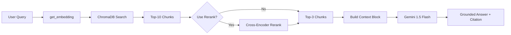

# Architecture — RAG Pipeline (Day 08 Lab)

## 1. Tổng quan kiến trúc

```
[Raw Docs]
    ↓
[index.py: Preprocess → Chunk → Embed → Store]
    ↓
[ChromaDB Vector Store]
    ↓
[rag_answer.py: Query → Retrieve → Rerank → Generate]
    ↓
[Grounded Answer + Citation]
```

**Mô tả ngắn gọn:**
Nhóm xây một trợ lý RAG nội bộ cho khối CS + IT Helpdesk để trả lời các câu hỏi về SLA, hoàn tiền, cấp quyền truy cập, IT FAQ và HR policy.
Pipeline gồm 3 phần chính: indexing tài liệu có metadata, retrieval theo vector similarity (kèm rerank ở variant), và generation có ràng buộc grounding + citation.
Mục tiêu là giảm hallucination, tăng khả năng truy xuất đúng nguồn bằng chứng, và cho phép đánh giá chất lượng theo scorecard định lượng.
Hệ thống là trợ lý nội bộ dành cho khối CS và IT Helpdesk, hỗ trợ tra cứu các chính sách hoàn tiền, quy trình cấp quyền và cam kết SLA. Hệ thống giải quyết vấn đề phản hồi chậm và nhầm lẫn thông tin bằng cách truy xuất dữ liệu từ các tài liệu chính thống và trích dẫn nguồn cụ thể.

---

## 2. Indexing Pipeline (Sprint 1)

### Tài liệu được index
| File | Nguồn | Department | Số chunk |
|------|-------|-----------|---------|
| `policy_refund_v4.txt` | policy/refund-v4.pdf | CS | 6 |
| `sla_p1_2026.txt` | support/sla-p1-2026.pdf | IT | 5 |
| `access_control_sop.txt` | it/access-control-sop.md | IT Security | 7 |
| `it_helpdesk_faq.txt` | support/helpdesk-faq.md | IT | 6 |
| `hr_leave_policy.txt` | hr/leave-policy-2026.pdf | HR | 5 |

**Tổng số chunks:** 29 chunks (Persistent storage tại `chroma_db/`).

### Quyết định chunking
| Tham số | Giá trị | Lý do |
|---------|---------|-------|
| Chunk size | 400 tokens | Đảm bảo mỗi chunk chứa đủ một đoạn chính sách hoàn chỉnh, tránh việc thông tin bị cắt quá vụn. |
| Overlap | 80 tokens | Tránh việc mất ngữ cảnh tại ranh giới cắt giữa các section hoặc paragraph. |
| Chunking strategy | Heading-based | Cắt dựa trên tiêu mục `=== Section ===` để giữ tính toàn vẹn của một điều khoản pháp lý/kỹ thuật. |
| Metadata fields | source, section, effective_date, department, access | Phục vụ trích dẫn nguồn, kiểm tra ngày hiệu lực và phân cấp quyền truy cập. |

### Embedding model
- **Model**: `paraphrase-multilingual-MiniLM-L12-v2` (Local Sentence-Transformers).
- **Lý do**: Đảm bảo tốc độ truy vấn nhanh, không phụ thuộc internet/quota API và bảo mật dữ liệu nội bộ.
- **Vector store**: ChromaDB (với thuật toán HNSW search).
- **Similarity metric**: Cosine Similarity.

---

## 3. Retrieval Pipeline (Sprint 2 + 3)

### Baseline (Sprint 2)
| Tham số | Giá trị |
|---------|---------|
| Strategy | Dense (embedding similarity) |
| Top-k search | 10 |
| Top-k select | 3 |
| Rerank | False |

### Variant (Sprint 3)
| Tham số | Giá trị | Thay đổi so với baseline |
|---------|---------|------------------------|
| Strategy | Dense + Rerank | Giữ nguyên bước search ban đầu nhưng thêm bộ lọc tinh. |
| Top-k search | 10 | Lấy rộng để bắt được nhiều ứng viên tiềm năng. |
| Top-k select | 3 | Chọn ra 3 đoạn "tinh túy" nhất sau khi qua Cross-Encoder. |
| Rerank Model | `ms-marco-MiniLM-L-6-v2` | Sử dụng để chấm điểm lại score dựa trên cặp (Query, Doc). |

**Lý do chọn variant này:**
Qua đánh giá Baseline, Dense search đôi khi mang về các đoạn văn có điểm ngữ nghĩa (cosine) cao nhưng không trực tiếp trả lời được câu hỏi (noise). Rerank giúp mô hình nhận diện được đoạn văn nào thực sự chứa câu trả lời cụ thể cho các tình huống Helpdesk phức tạp, từ đó cải thiện tính đầy đủ (Completeness).

---

## 4. Generation (Sprint 2)

### Grounded Prompt Template
Hệ thống sử dụng cấu trúc tách biệt giữa **System Instruction** (để giữ model trong context) và **Context Block** (chứa bằng chứng).

**Ràng buộc chính:**
1. **Evidence-only**: Không dùng kiến thức bên ngoài.
2. **Abstain**: Nói "không biết" nếu context không đủ.
3. **Citation**: Gắn mã nguồn `[1]`, `[2]` vào sau mỗi tuyên bố factual.

### LLM Configuration
| Tham số | Giá trị |
|---------|---------|
| Model | gemini-1.5-flash |
| Temperature | 0 (đảm bảo tính ổn định tối đa cho việc đánh giá) |
| Max tokens | 512 |

---

## 5. Failure Mode Checklist

| Failure Mode | Triệu chứng | Cách khắc phục |
|-------------|-------------|---------------|
| Hallucination | Model bịa thêm ngày tháng không có trong docs | Ép rules trong System Prompt và dùng Temp=0. |
| Retrieval lỗi | LLM trả lời "không biết" dù tài liệu có dữ liệu | Kiểm tra metadata `access` hoặc tăng `top_k_search`. |
| Loss of Citation | Câu trả lời hay nhưng không trích nguồn | Dùng One-shot example trong prompt hoặc dùng model mạnh hơn. |

---

## 6. Diagram


