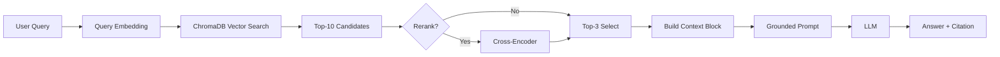

# Architecture — RAG Pipeline (Day 08 Lab)

> Template: Điền vào các mục này khi hoàn thành từng sprint.
> Deliverable của Documentation Owner.

## 1. Tổng quan kiến trúc

```
[Raw Docs]
    ↓
[index.py: Preprocess → Chunk → Embed → Store]
    ↓
[ChromaDB Vector Store]
    ↓
[rag_answer.py: Query → Retrieve → Rerank → Generate]
    ↓
[Grounded Answer + Citation]
```

**Mô tả ngắn gọn:**
Nhóm xây một trợ lý RAG nội bộ cho khối CS + IT Helpdesk để trả lời các câu hỏi về SLA, hoàn tiền, cấp quyền truy cập, IT FAQ và HR policy.
Pipeline gồm 3 phần chính: indexing tài liệu có metadata, retrieval theo vector similarity (kèm rerank ở variant), và generation có ràng buộc grounding + citation.
Mục tiêu là giảm hallucination, tăng khả năng truy xuất đúng nguồn bằng chứng, và cho phép đánh giá chất lượng theo scorecard định lượng.

---

## 2. Indexing Pipeline (Sprint 1)

### Tài liệu được index
| File | Nguồn | Department | Số chunk |
|------|-------|-----------|---------|
| `policy_refund_v4.txt` | policy/refund-v4.pdf | CS | 6 |
| `sla_p1_2026.txt` | support/sla-p1-2026.pdf | IT | 5 |
| `access_control_sop.txt` | it/access-control-sop.md | IT Security | 7 |
| `it_helpdesk_faq.txt` | support/helpdesk-faq.md | IT | 6 |
| `hr_leave_policy.txt` | hr/leave-policy-2026.pdf | HR | 5 |

### Quyết định chunking
| Tham số | Giá trị | Lý do |
|---------|---------|-------|
| Chunk size | 400 tokens (xấp xỉ) | Cân bằng giữa giữ ngữ cảnh điều khoản và tránh context quá dài khi generate |
| Overlap | 80 tokens (xấp xỉ) | Giảm mất thông tin tại ranh giới chunk, nhất là với câu hỏi cần điều kiện ngoại lệ |
| Chunking strategy | Heading-based + paragraph-based | Ưu tiên cắt theo section tự nhiên ("=== Section ... ==="), sau đó chia theo paragraph nếu section quá dài |
| Metadata fields | source, section, effective_date, department, access | Phục vụ filter, freshness, citation |

### Embedding model
- **Model**: sentence-transformers `paraphrase-multilingual-MiniLM-L12-v2` (local embedding)
- **Vector store**: ChromaDB (PersistentClient)
- **Similarity metric**: Cosine

---

## 3. Retrieval Pipeline (Sprint 2 + 3)

### Baseline (Sprint 2)
| Tham số | Giá trị |
|---------|---------|
| Strategy | Dense (embedding similarity) |
| Top-k search | 10 |
| Top-k select | 3 |
| Rerank | Không |

### Variant (Sprint 3)
| Tham số | Giá trị | Thay đổi so với baseline |
|---------|---------|------------------------|
| Strategy | Dense + rerank | Giữ dense retrieval, thêm bước rerank cross-encoder trước khi chọn top-k |
| Top-k search | 10 | Không đổi |
| Top-k select | 3 | Không đổi |
| Rerank | Cross-encoder (`cross-encoder/ms-marco-MiniLM-L-6-v2`) | Bật rerank (`use_rerank=True`) |
| Query transform | Không dùng | Không đổi query gốc để tuân thủ A/B rule |

**Lý do chọn variant này:**
Nhóm chọn rerank vì baseline dense thường retrieve đúng nguồn nhưng chưa luôn chọn được thứ tự top-3 tối ưu cho generation.
Rerank được kỳ vọng cải thiện quality của context đưa vào prompt (đặc biệt completeness/relevance) mà không thay đổi index, chunking hoặc prompt.
Thiết kế này tuân thủ A/B rule: chỉ đổi đúng một biến là `use_rerank`.

---

## 4. Generation (Sprint 2)

### Grounded Prompt Template
```
Answer only from the retrieved context below.
If the context is insufficient, say you do not know.
Cite the source field when possible.
Keep your answer short, clear, and factual.

Question: {query}

Context:
[1] {source} | {section} | score={score}
{chunk_text}

[2] ...

Answer:
```

### LLM Configuration
| Tham số | Giá trị |
|---------|---------|
| Model | gpt-4o-mini (OpenAI) |
| Temperature | 0 (để output ổn định cho eval) |
| Max tokens | 512 |

---

## 5. Failure Mode Checklist

> Dùng khi debug — kiểm tra lần lượt: index → retrieval → generation

| Failure Mode | Triệu chứng | Cách kiểm tra |
|-------------|-------------|---------------|
| Index lỗi | Retrieve về docs cũ / sai version | `inspect_metadata_coverage()` trong index.py |
| Chunking tệ | Chunk cắt giữa điều khoản | `list_chunks()` và đọc text preview |
| Retrieval lỗi | Không tìm được expected source | `score_context_recall()` trong eval.py |
| Generation lỗi | Answer không grounded / bịa | `score_faithfulness()` trong eval.py |
| Token overload | Context quá dài → lost in the middle | Kiểm tra độ dài context_block |

---

## 6. Diagram (tùy chọn)

Sơ đồ pipeline hiện tại:


