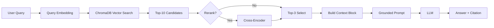

# Architecture — RAG Pipeline (Day 08 Lab)

## 1. Tổng quan kiến trúc

```
[Raw Docs]
    ↓
[index.py: Preprocess → Chunk → Embed → Store]
    ↓
[ChromaDB Vector Store]
    ↓
[rag_answer.py: Query → Retrieve → Rerank → Generate]
    ↓
[Grounded Answer + Citation]
```

**Mô tả ngắn gọn:**
Nhóm xây một trợ lý RAG nội bộ cho khối CS + IT Helpdesk để trả lời các câu hỏi về SLA, hoàn tiền, cấp quyền truy cập, IT FAQ và HR policy.
Pipeline gồm 3 phần chính: indexing tài liệu có metadata, retrieval theo vector similarity (kèm rerank ở variant), và generation có ràng buộc grounding + citation.
Mục tiêu là giảm hallucination, tăng khả năng truy xuất đúng nguồn bằng chứng, và cho phép đánh giá chất lượng theo scorecard định lượng.
Hệ thống là trợ lý nội bộ dành cho khối CS và IT Helpdesk, hỗ trợ tra cứu các chính sách hoàn tiền, quy trình cấp quyền và cam kết SLA. Hệ thống giải quyết vấn đề phản hồi chậm và nhầm lẫn thông tin bằng cách truy xuất dữ liệu từ các tài liệu chính thống và trích dẫn nguồn cụ thể.

---

## 2. Indexing Pipeline (Sprint 1)

### Tài liệu được index
| File | Nguồn | Department | Số chunk |
|------|-------|-----------|---------|
| `policy_refund_v4.txt` | policy/refund-v4.pdf | CS | 6 |
| `sla_p1_2026.txt` | support/sla-p1-2026.pdf | IT | 5 |
| `access_control_sop.txt` | it/access-control-sop.md | IT Security | 7 |
| `it_helpdesk_faq.txt` | support/helpdesk-faq.md | IT | 6 |
| `hr_leave_policy.txt` | hr/leave-policy-2026.pdf | HR | 5 |
| `policy_refund_v4.txt` | policy/refund-v4.pdf | CS | 6 |
| `sla_p1_2026.txt` | support/sla-p1-2026.pdf | IT | 5 |
| `access_control_sop.txt` | it/access-control-sop.md | IT Security | 7 |
| `it_helpdesk_faq.txt` | support/helpdesk-faq.md | IT | 6 |
| `hr_leave_policy.txt` | hr/leave-policy-2026.pdf | HR | 5 |

Tổng số chunks: 29

### Quyết định chunking
| Tham số | Giá trị | Lý do |
|---------|---------|-------|
| Chunk size | 400 tokens (xấp xỉ) | Cân bằng giữa giữ ngữ cảnh điều khoản và tránh context quá dài khi generate |
| Overlap | 80 tokens (xấp xỉ) | Giảm mất thông tin tại ranh giới chunk, nhất là với câu hỏi cần điều kiện ngoại lệ |
| Chunking strategy | Heading-based + paragraph-based | Ưu tiên cắt theo section tự nhiên ("=== Section ... ==="), sau đó chia theo paragraph nếu section quá dài |
| Metadata fields | source, section, effective_date, department, access | Phục vụ filter, freshness, citation |
| Chunk size | 400 tokens | Đảm bảo mỗi chunk chứa đủ một đoạn chính sách hoàn chỉnh (khoảng 1600 ký tự). |
| Overlap | 80 tokens | Tránh việc mất ngữ cảnh tại ranh giới cắt giữa các paragraph. |
| Chunking strategy | Heading-based | Cắt dựa trên tiêu mục `=== Section ===` để giữ tính toàn vẹn của điều khoản. |
| Metadata fields | source, section, effective_date, department, access | Phục vụ trích dẫn nguồn, kiểm tra ngày hiệu lực và quyền truy cập. |

### Embedding model
- **Model**: sentence-transformers `paraphrase-multilingual-MiniLM-L12-v2` (local embedding)
- **Model**: `paraphrase-multilingual-MiniLM-L12-v2` (Sentence-Transformers)
- **Vector store**: ChromaDB (PersistentClient)
- **Similarity metric**: Cosine (hnsw:space)

---

## 3. Retrieval Pipeline (Sprint 2 + 3)

### Baseline (Sprint 2)
| Tham số | Giá trị |
|---------|---------|
| Strategy | Dense (embedding similarity) |
| Top-k search | 10 |
| Top-k select | 3 |
| Rerank | Không |

### Variant (Sprint 3)
| Tham số | Giá trị | Thay đổi so với baseline |
|---------|---------|------------------------|
| Strategy | Dense + rerank | Giữ dense retrieval, thêm bước rerank cross-encoder trước khi chọn top-k |
| Top-k search | 10 | Không đổi |
| Top-k select | 3 | Không đổi |
| Rerank | Cross-encoder (`cross-encoder/ms-marco-MiniLM-L-6-v2`) | Bật rerank (`use_rerank=True`) |
| Query transform | Không dùng | Không đổi query gốc để tuân thủ A/B rule |
| Strategy | Dense + Rerank | Giống baseline ở bước search, nhưng thêm bước lọc lại. |
| Top-k search | 10 | Lấy rộng để bắt được nhiều ứng viên tiềm năng. |
| Top-k select | 3 | Chọn ra 3 đoạn tinh túy nhất sau khi rerank. |
| Rerank | Cross-Encoder | Sử dụng `ms-marco-MiniLM-L-6-v2` để chấm điểm lại mức độ liên quan. |
| Query transform | None | Giữ nguyên query để đảm bảo tính ổn định. |

**Lý do chọn variant này:**
Nhóm chọn rerank vì baseline dense thường retrieve đúng nguồn nhưng chưa luôn chọn được thứ tự top-3 tối ưu cho generation.
Rerank được kỳ vọng cải thiện quality của context đưa vào prompt (đặc biệt completeness/relevance) mà không thay đổi index, chunking hoặc prompt.
Thiết kế này tuân thủ A/B rule: chỉ đổi đúng một biến là `use_rerank`.
Nhóm chọn **Rerank** vì tập dữ liệu chính sách (Policy) thường có nhiều câu chữ lặp lại (như "điều kiện", "quy trình"). Rerank giúp mô hình nhận diện được đoạn văn nào thực sự chứa câu trả lời cho câu hỏi cụ thể của người dùng thay vì chỉ dựa vào độ tương đồng vector chung chung.

---

## 4. Generation (Sprint 2)

### Grounded Prompt Template
Hệ thống sử dụng cấu trúc tách biệt giữa **System Instruction** và **Context Block**:

**System Prompt:**
- EVIDENCE ONLY: Chỉ trả lời từ context.
- ABSTAIN: Không có trong docs thì nói "Thông tin này không có trong tài liệu...".
- CITATION: Luôn gắn mã nguồn `[1]`, `[2]`.

**Context Block Format:**
`[số] source | section | dept | effective: date | score=val\n<nội dung chunk>`

### LLM Configuration
| Tham số | Giá trị |
|---------|---------|
| Model | gpt-4o-mini (OpenAI) |
| Temperature | 0 (để output ổn định cho eval) |
| Model | gemini-2.5-flash |
| Temperature | 0 (để kết quả nhất quán) |
| Max tokens | 512 |

---

## 5. Failure Mode Checklist

| Failure Mode | Triệu chứng | Cách kiểm tra |
|-------------|-------------|---------------|
| Index lỗi | Trích dẫn file cũ (v3 thay vì v4) | Kiểm tra `effective_date` trong metadata. |
| Chunking tệ | Câu trả lời bị cụt ngủn hoặc mất ý | Xem đoạn preview trong log `[RAG] Context block`. |
| Retrieval lỗi | LLM trả lời "không biết" dù docs có | Tăng `top_k_search` hoặc kiểm tra score trùng khớp. |
| Generation lỗi | Câu trả lời hay nhưng không có citation | Kiểm tra System Prompt và ép model tuân thủ. |

---

## 6. Diagram (tùy chọn)

Sơ đồ pipeline hiện tại:


