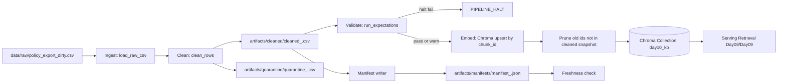

# Kiến trúc pipeline — Lab Day 10

**Nhóm:** _____________  
**Cập nhật:** 2026-04-15

---

## 1. Sơ đồ luồng (Mermaid)

Điểm ghi nhận bắt buộc trong log: `run_id`, `raw_records`, `cleaned_records`, `quarantine_records`, trạng thái expectation, `embed_prune_removed`, `embed_upsert count`.

---

## 2. Ranh giới trách nhiệm

| Thành phần | Input | Output | Owner nhóm |
|------------|-------|--------|--------------|
| Ingest | `data/raw/policy_export_dirty.csv` | Raw rows in-memory | Thành viên 1 |
| Transform | Raw rows | `cleaned_<run_id>.csv`, `quarantine_<run_id>.csv` | Thành viên 1 |
| Quality | Cleaned rows | Expectation results (`warn`/`halt`) | Thành viên 2 |
| Embed | Cleaned CSV | Chroma vectors (`chunk_id` keyed) | Thành viên 2 |
| Monitor | Manifest JSON | PASS/WARN/FAIL freshness | Thành viên 3 |

---

## 3. Idempotency & rerun

Pipeline embed đảm bảo idempotent theo snapshot publish:

- Upsert theo `chunk_id`: cùng dữ liệu clean khi rerun sẽ ghi đè metadata/document hiện có thay vì tạo thêm vector mới.
- Prune id dư: trước khi upsert, pipeline lấy toàn bộ id hiện có trong collection và xóa các id không còn xuất hiện trong cleaned run hiện tại (`embed_prune_removed=<n>`).
- Kết quả: chạy ETL nhiều lần với cùng cleaned snapshot không làm phình collection; chạy với snapshot mới sẽ thay đúng tập id mục tiêu.

---

## 4. Liên hệ Day 09

Day 10 chịu trách nhiệm chuẩn hóa và publish dữ liệu sạch vào vector store. Day 09 có thể tái sử dụng collection đã publish để multi-agent retrieval ổn định hơn (tránh chunk stale như refund 14 ngày hoặc HR policy cũ). Boundary rõ ràng: Day 09 không sửa dữ liệu nguồn, chỉ truy vấn lớp dữ liệu đã qua clean + validate của Day 10.

---

## 5. Rủi ro đã biết

- Nếu chạy với `--skip-validate`, expectation halt chỉ ghi log và vẫn embed; phải dùng đúng mục đích inject test.
- Freshness có thể WARN/FAIL khi dùng snapshot cũ trong bộ dữ liệu mẫu; cần giải thích rõ SLA boundary trong runbook.
- Nếu đổi công thức `chunk_id` mà không đồng bộ, rerun có thể gây churn vector lớn dù nội dung không đổi.
